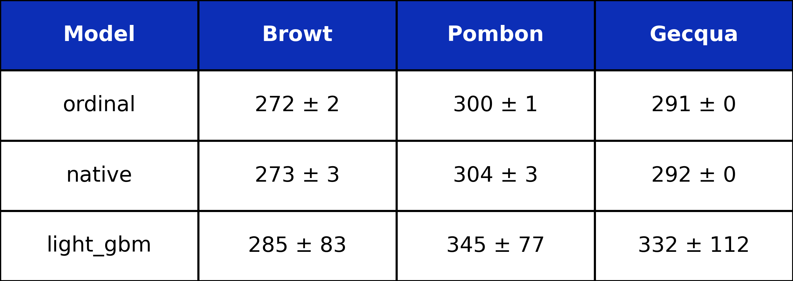
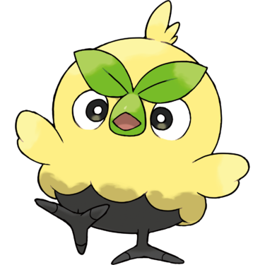
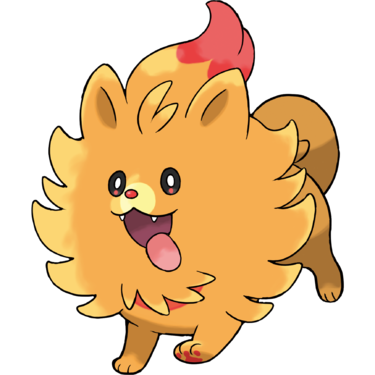
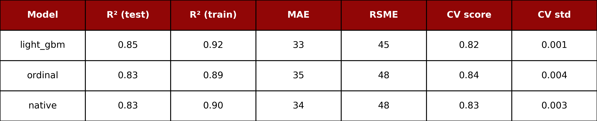

# PoKemon ML Predictor

- This project aims to predict the `BST`, known as `total_stats` (sum of base stats: HP + atk + def + sp.atk + sp.def + spe) for existing and future Pokémon generations using ML.

- The project will train different models and will dive down in feature engineering inspired by zoomorphology, the biology discipline that studies animal shapes. This will provide a further boost to the model predictions. 

- Game Freak, the Pokemon videogame developers, are probably biased by nature when creating pokemons. In that sense, these creatures should follow this underlying bias and their properties, like `BST` are secretly related to this nature imprint.

## Predicted values for New Generation Pokemon

<!-- Leaderboard Section -->
<table align="center" style="table-layout: fixed; width: 100%; max-width: 1000px;">
<tr>
  <td align="center">
    
     <strong>BST Predictions for different models</strong>
  </td>
</tr>
</table>

<table align="center">
  <tr>
    <td align="center"></td>
    <td align="center"></td>
    <td align="center"></td>
  </tr>
  <tr>
    <td align="center"><strong>Best BST so far 273</strong></td>
    <td align="center"><strong>Best BST so far 304</strong></td>
    <td align="center"><strong>Best BST so far 292</strong></td>
  </tr>
</table>

## The metrics leaderboard for 3 different models. Currently, no training at all.
<!-- Leaderboard Section -->
<table align="center" style="table-layout: fixed; width: 100%; max-width: 1000px;">
<tr>
  <td align="center">
    
     <strong>R2 Leaderboard for different models</strong>
  </td>
</tr>
</table>

>
